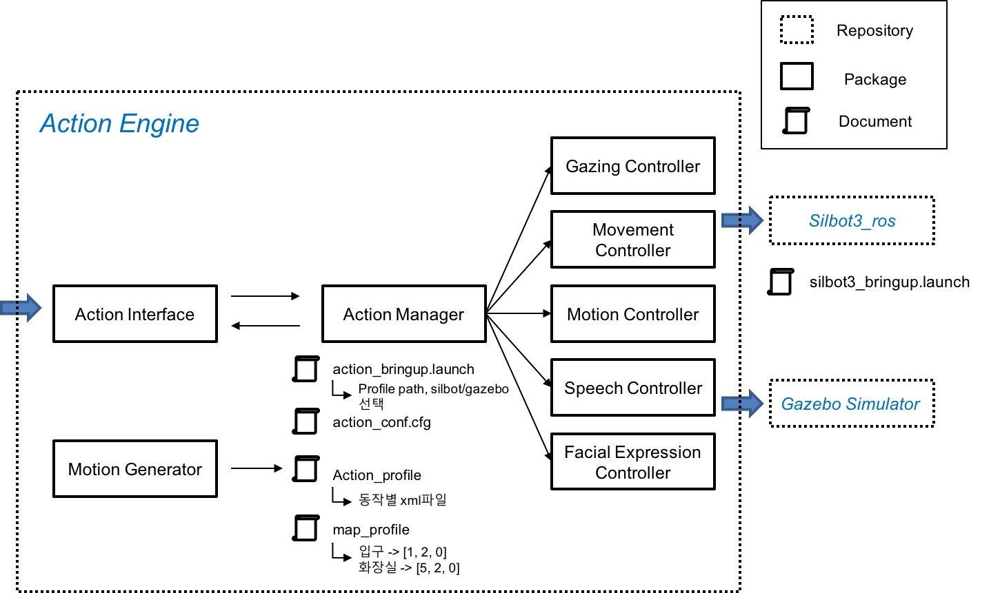
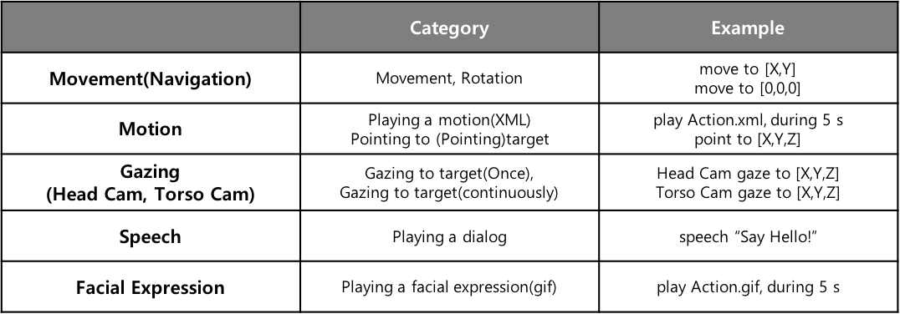
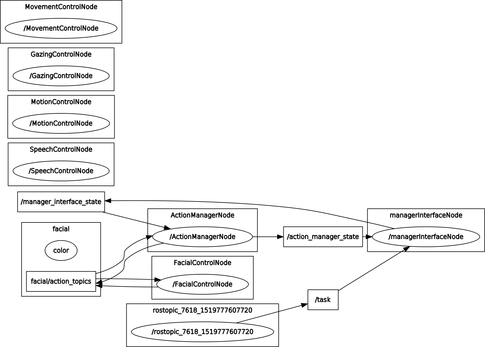
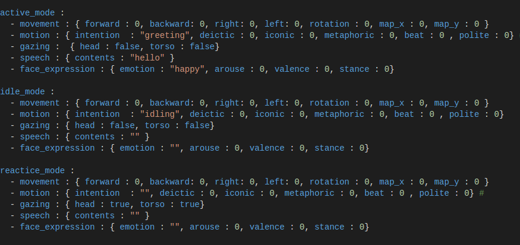
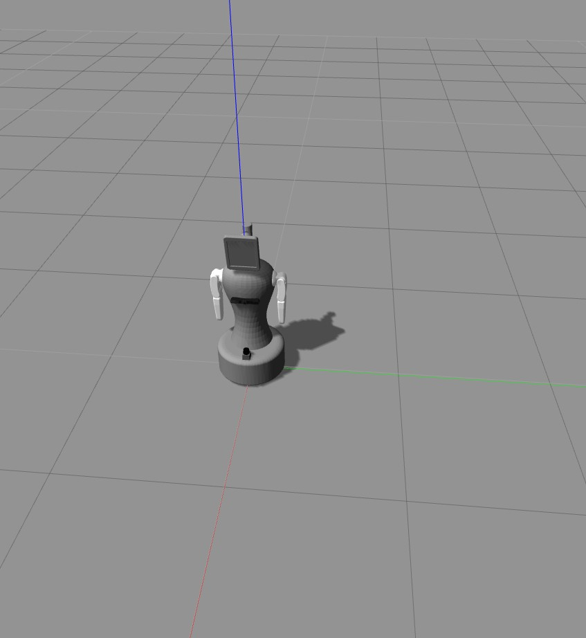
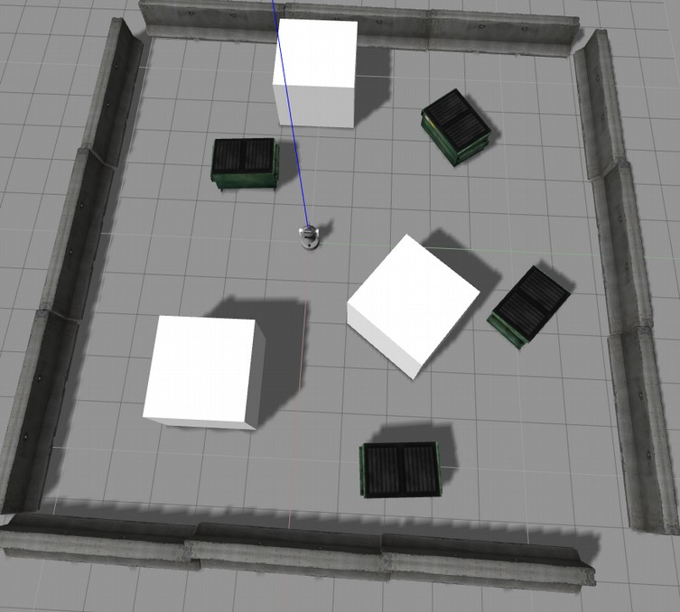
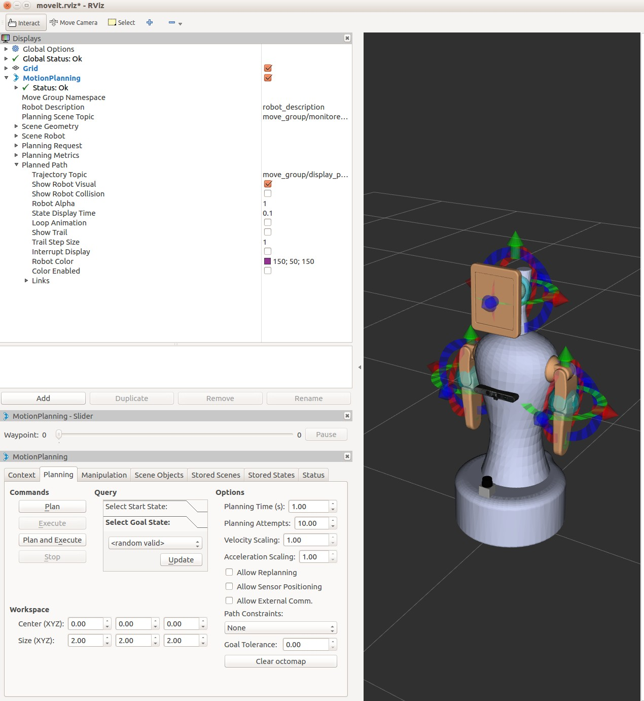
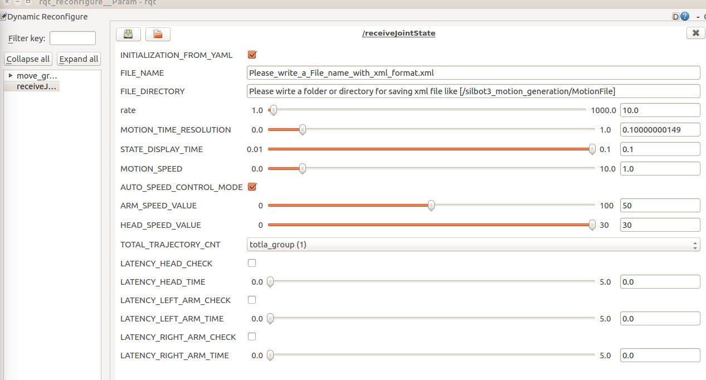

# sHRI-Lab : Action Engine

This repository is used to make silbot3 expression, which contain motion generation(MoveIt) and xml parsing package and action manager and move_control


## 1. Description
It is used to make motion file with xml format and classify motion along with mode.

### 1.1 Framework Structure



### 1.2 Node Description

Action Manager :
Manager Interface
Motion Controller :
Movement(Navigation) Controller : 
Gazing Controller :
Facial Expression Controller :

### 1.3 Action Mode & Action Description

#### List of Robot Mode


#### List of Robot Action



Action manager(silbot3_action_manager) selects action mode according to input of action interface and current state and manages controllers with actionlib.

Basic concept(with rosgraph)

- if the current state of Action manager is ACTIVE_MODE, motion and movement and speech and facial controlller will work.

- if the current state of Action manager is REACTIVE_MODE, gazing and facial controlller will work.

- if the current state of Action manager is ACTIVE_MODE, motion and facial controlller will work.

- It is a image when it is connected between action_manager and facial controller.



- The data associated with each action mode is uploaded in XML Server.


### 1.4 Package Description

1. Silbor3_2dnav

This is a package for implementing Navigation function.
It is basically used to using move_base function, therefore launch files
and yaml files is described according to default format.

2. Silbot3_description

It is a package for silbot3 to have its modeling data which include stl
file with mesh and URDF file(XACRO) describing relationship between
joint and link.
It also includes launch file to run in the GAZEBO which means 3D
virtual environment.

3. Silbot3_feasible_moveit

It is used to utilizing MoveIt API, but now it isn’t used .

4. Silbot3_gazebo

It is a package to deploying various functions in the GAZEBO.
For using ros_control, It is added to yaml file regarding controller(ex.
Position, trajectory controller) and launch file to run.

5. Silbot3_motion_generation

It is used to making motion generation program based on MoveIt!, but
it is considerably transformed for implementing motion generation
program and linked silbot3_xmlparsing package.

6. Silbot3_msgs

It is a package provided by the Robocare.
It included msg and service file for working Silbot3.

7. Silbot3_omniwheels(incomplete)

It is a package for other researcher to implement holonomic
constraint which means omni-wheels mobility here and added for
working navigation functions in the GAZEBO.

8. Silbot3_slam

It is a package for working mapping and map server.

9. Silbot3_teleoperation

It is a package for looking movement of Silbot3 in the GAZEBO and
means “Teleoperation” function using Keyboard.

10. Silbot3_tutorial

It is a package for working silbot3 in the Robocare.
It is written by Python and C(++) according to various function, for
example LED and movement... , It is just added to take possibility for
working Silbot3 in real.

11. Silbot3_xmlparsing

It is a package which has Tinyxml library which helps to make xml
files and makes xml files for working Silbot3.
Using Xml files, you can work Silbot3 in real and GAZEBO.


## 2. Getting Started

### 2.1 Requirements

|      OS      | ROS version |           Note           |
|:------------:|:-----------:|:------------------------:|
| Ubuntu 16.04 |   Kinetic   | *Build order is important* |

```
sudo apt-get install ros-kinetic-gazebo-ros-control
sudo apt-get install ros-kinetic-moveit*
sudo apt-get install ros-kinetic-joint-state-controller*
sudo apt-get install ros-kinetic-interactive-markers 
sudo apt-get install ros-kinetic-dynamic-reconfigure
```
And then you should copy from your_workspace/devel/silbot3_xmlparsing
package to /opt/ros/kinetic/devel since dependency problem is not solved
	
```
sudo cp –rp <your_workspace>/devel/lib/silbot3_xmlparsing /opt/ros/kinetic/devel
```


### 2.2 Install guide

Make the new workspace for this framework(Optional)
```
mkdir -p ~/action_ws/src
cd ~/action_ws/src
catkin_init_workspace
cd ~/action_ws
catkin_make
echo 'source ~/action_ws/devel/setup.bash' >> ~/.bashrc
echo 'export ROS_PACKAGE_PATH=~/action_ws/:${ROS_PACKAGE_PATH}' >> ~/.bashrc
```
and clone github repository
```
cd ~/action_ws/src
git clone git@github.com:hyeonukbhin/action_engine.git
```
and catkin_make in ~/action_ws
```
cd ~/action_ws
catkin_make
```
## 3. Usage

### 3.1 Robot Simulation in Gazebo

Load the model of Silbot3 in the GAZEBO.
```
roslauch silbot3_description only_silbot.launch
```



Load the model of Silbot3 with obstacles in the GAZEBO.

```
roslaunch silbot3_description silbot3_collision_xacro.launch
```



Load the model of Silbot3 with obstacle in the GAZEBO and controller.
Once you load the model,
```
roslaunch silbot3_description silbot3_collision_xacro.launch
```
if you want to implement position controller, you can write
```
roslaunch silbot3_gazebo silbot_arm_position_controller.launch
```
if you want to check xml file, you should load the position controller.
if you want to implement position controller, you can write
```
roslaunch silbot3_gazebo silbot_arm_trajectory_controller.launch
```

### 3.2 Motion Generation for Silbot3

It is saved in the ./doc folder.

It can make xml file in the Rviz using Silbot3.
First, you can see this GUI when you command as:
```
roslaunch silbot3_motion_generation motionGenerationProgram.launch
```
**(Please check “Allow Approximate IK Solution” checkbox in left-bottom since it can give to control arm of silbot3 easily.)**



Second, You can choice Planning tab in left-bottom for making xml file
In this case, you can control silbot3 using interactive markers
When you click the “Plan” button, you can see trajectory to which arm and head of silbot3 move according.
**(Its process isn’t affect making a xml file.)**
When you click the “Execute” or “Plan and Execute” button, making a xml file immediately works according to the trajectory of “Plan” and depends on previous operation.


Finally, you can modulate many parameters and determine file name and directory. INITIALIZATION_FROM_YAML param confirms whether it is initialized using yaml file.
FILE_NAME param is file name which you want to take. FILE_DIRECTORY is saved directory of file which you want to take. rate param is the rate of /joint_state topic. MOTION_TIME_RESOLUTION param is value of time gap of xml file. AUTO_SPEED_CONTROL_MODE param is autonomous mode, if you select it, it autonomously decide param of speed value. ARM_SPEED_VALUE, HEAD_SPEED_VALUE described with speed value in xml file.
param is value to be TOTAL_TRAJECTORY_CNT param is count how to work frequently, but it don’t need to control.
LATENCY params provide latency function, it can be selected with group and should have amount of latency time in order to work



### 3.3 Playing the created motion in GAZEBO.

In order to play motion of slilbot3 with xml file in GAZEBO, you will mostly use the silbot3_xmlparsing package.
Once you finish previous task such as loading model in GAZEBO and working position controller, you can check playing motion of Silbot3.
You should parse the xml file.
${prefix} : the directory of xml file you want
($(arg file name)) : the file name of xml file you want
```
rosrun silbot3_xmlparsing silbot3_xmlparsing ${prefix}/($(arg file name))
```
You can see motion of Silbot3.
```
rosrun silbot3_xmlparsing trXml2Cmd
```
### 3.4 Launch Full Bringup
```
roslaunch silbot3_action_manager silbot3_action_manager.launch --screen(remote)
roslaunch silbot3_action_manager silbot3_manager_interface.launch --screen(remote)
roslaunch silbot3_action_manager silbot3_action_controller.launch --screen(remote)
roslaunch silbot3_bringup minimum.launch --screen (silbot3)
```
```
rostopic pub /task silbot3_action_manager/inputTask "intention: 'active_mode'polite: 1.0" 
```


