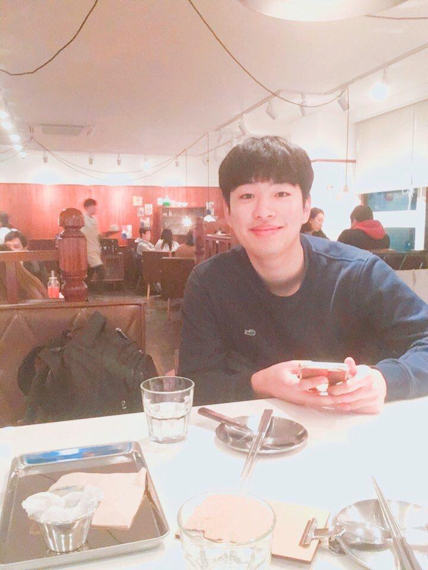

# Welcome to Geonhee Pages

{: width="10" height="10"}


## Name : Lee Geon hee(Sam,lee)

### Interests : Robotics, Mechanical control, Reinforcement learning

#Contact
  - E-mail : gunhee6392@gmail.com
  - Dept. of Mechanical system design engineering, Seoul National Univ. of Science and Technology, 172 Gongneung 2-dong, Nowon-gu, Seoul 139-743, Korea.


### Jekyll Themes

Your Pages site will use the layout and styles from the Jekyll theme you have selected in your [repository settings](https://github.com/Geonhee-LEE/geon.github.io/settings). The name of this theme is saved in the Jekyll `_config.yml` configuration file.


```markdown
Syntax highlighted code block

# Header 1
## Header 2
### Header 3

- Bulleted
- List

1. Numbered
2. List

**Bold** and _Italic_ and `Code` text

[Link](url) and 
```

For more details see [GitHub Flavored Markdown](https://guides.github.com/features/mastering-markdown/).


### Support or Contact

Having trouble with Pages? Check out our [documentation](https://help.github.com/categories/github-pages-basics/) or [contact support](https://github.com/contact) and we’ll help you sort it out.
