# Team RND Description

## Seoul National University of Science and Technology, Mechatronics Lab

Room 317, Frontier Hall, Seoul National University of Technology, Gongneung 2(i)-dong, 139-743 Nowon-gu, Seoul, Republic of Korea(http://cafe.naver.com/snutrnd)

## Abstract

 This paper describes the specifications of our humanoid soccer robots. We have developed this robot for Robocup2014. Robot RND-Spirit has 20 DOF. Robot RND-Ultra has 25 DOF, 1-CMOS sensors, 3-axis rate gyro sensors, 2-axis tilt sensor. This robot has fully autonomous system fitting the humanoid Robocup competition. We have researched stabilization and artificial intelligence of the humanoid robot. This robot is integrated our whole technique.

### 1.Introduction

Robocup Humanoid League is an annual human-interactive robot competition which
evolves every year with increasing size and the number of the participating robots, and thus creates more challenges for the participants. The participating robot must be able to fully recognize and chase the object (ball), and identify the goal and location of itself. To make this possible, RnD (Seoultech, Republic of Korea) is researching humanoids as well as developing techniques and skills that are required under Professor Kim’s supervision. RnD also is funded by Robocube. Inc. for further research possible. The team focuses on the in state competitions for advancement, and has been rewarded in various competitions such as Robogames, RobotJapan, Firacup, IRC(International Robot Contest). The following documentation is written to illustrates the undergoing research, hardware and software for participation of RoboCup.

### 2.Mechanical Specifications

The following kid-sized robots are made from scratch in the team. Their names are RND-Spirit and RND-Ultra, representing the motto of the team. These robots are developed in a good fit for Kid Size robot soccer. RND-Spirit comes with 515mm height and 3.8 kg mass. RND-Ultra comes with the height of 565mm and 4.9 kg of mass. [Figure 2.1] and [Figure 2.2] illustrate the visualizations and the structures of the robots. [Table 2.1] and [Table2.2] summarizes the angle range of each of the joints. RND-Spirit (Kicker-Robot) contains 20 joints including the neck, arm limits. The actuator DYNAMIXEL RX-64 (manufactured by ROBOTIZ) is used for the joint movement of hip pitch, Knee Pitch , Angle pitch and the rest joints are accompanied by the actuator DYNAMIXEL RX-28 (manufactured by ROBOTIZ). RND-Ultra contains 25 joints including the leg, upper body, neck, arm limits. Its hip pitch, knee pitch, angle pitch are accompanied by the actuator DYNAMIXEL EX-106+, and the rest of the joints are connected by DYNAMIXEL RX-28 and DYNAMIXEL RX-64.

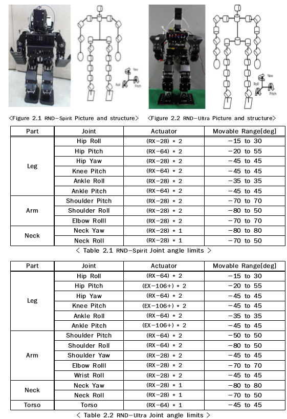

### 3.Electrical specifications and sensor feedback

- Overall Electrical Specification -

For motor sensors, our team uses gyro sensors and Tilt sensors. In case robot falls off by an external force, the sensors deliver data to get it up on its feet. Gyro Sensor prevents the robot from falling by providing data to each of the motors, and transmitting the information provided by the Cam visual by Embedded(PC) to the motors.

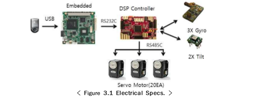

- Motion Controller -

The RnD team uses TMS320F2810 by TI for the robot’s micro motion controller DSP. It controls 20 servo motors, and accepts data provided by the gyro sensor and the tilt sensor. For the communication system, the team uses RS485, RS232 Communication. Our
team Uses RS485 Communication for motor control. The camera processes the visual data in the PC, and sends the motion command via 232 Communication. As shown in the <Figure 3.2>, the controller is open to additional accessibility. The current rule forbids us from using the electromagnetic radiation for measurement of distance, so we are only using 3-axis gyro sensor and 2-axis Tilt sensor.

- Sensor -

3-axis gyro sensor is self made in our team. Using the sensor, the balance of the robot’s x-axis and y-axis is stabilized. For stabilization of the x-aixs, the sensor sends the counter balancing data of the hip joint (front and back), and both ankles . Stabilization of the y-axis works the same to send the information to the servo motors of the hip roll joint and ankle roll joint.

### 4.Software specifications

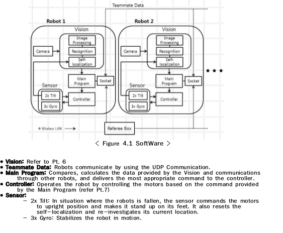

### 5.Image processing

#### 5-1. Visualization

Our visualization is based on the efficient algorithm, which allows the robot to recognize the field, goal, and the ball to draw out the virtual image of the field, including the x and y axis. This is done by Webcam, with the speed of 20 frames per second. The colorization of the virtual map of the filed in done by Hue, Saturation, and Value (HSV) for the sake of distinguished visualization.

- Field

As shown in Figure 5-1.1, the field is visualized by the HSV, with the horizontal projection to recognized the start of the filed. To limit the size range of the visual within the limits of the field, the start of the field is required.

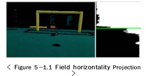

- Ball

As shown in the Figure 5-1.2 , the robot recognizes and calculates the coordinates of the ball based on the information obtained by labeling the HSV image. The coordinated location becomes Region of Interest, allowing the robot to detect the less light- sensitive surface of the ball and determine the final coordinate of the ball. Using this method, the final location of the ball becomes more accurate. We also added the partial image editing program to improve the pace of visual recognition. This program lets the visual to shrink down to the main area of the focus, allowing the robot to calculate the data even
faster. The distance between the robot and the ball is evaluated from the data given by the images.

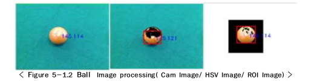

- Goal

The goal, as shown in Figure 5-1.3 is projected with vertical and horizontal visuals. Using the horizontal projection, the goal's height and the cross bar are measured. Using the vertical projection, the length, direction, and width of the goal are measured. These data are utilized only for self locating purpose. Data from the images help the robot determine the location of the goal, ball and robot itself on the field.

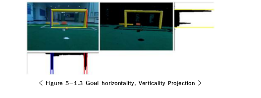

#### 5-2. Localization

It is indeed significant for the robot to know its location in robot soccer. The localization is the key to continue the game, and create an efficient pathway to score a goal . Also, it is important for the robot to be able to distinguish between the
ally’s and opponent’s goals. Since the two goals are identical, the robot has nothing to rely on but the localization skills. Our team utilizes the inversely countered visualization in respect to the distance of the object between the robot and the ball. Our localization system relies on the perspective measurement of the size of the object in respect to the distance.
The robot uses the information provided from the goal to determine its location. The number of the pixels present in the image is utilized accurately determine the distance. <Figure5-2.1 >

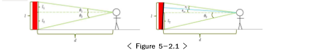

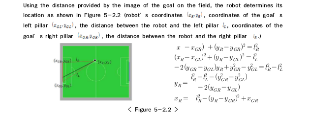

We have also implemented the possibility application for more accurate result of coordinates provided by the method above. The possible coordinates are based on the calculation of the differently set significance of the coordinates. In a situation where the possibility of calculating the right direction is low, the robot uses the opponent’s robot’s coordination, and reverse to make it its own.

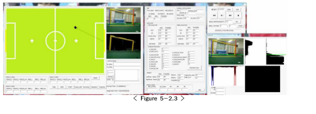

### 6. Motion control

We also created our own motion control. One motion can be made of 40 individual points, and the delay time and overall time are editable. This type of motion can be saved up to 256 motions and is put in use when needed. Basic movements such as Forward, Backward, Right, Left and Spin are preloaded, and one may combine any of these movements to create a unique movement. The same movement is carried on repeatedly.Movement calibration, pattern, pace, and speed are customizable by commands.

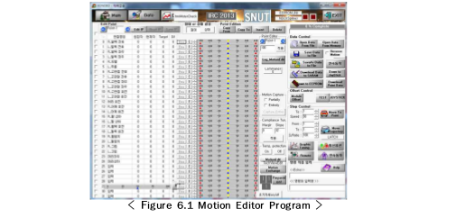

### 7. MISSION EXAMPLE

#### 7-1. Basket Ball

Color Space coverts the RGB (Red, Green, Blue) visual into HSV (Hue, Saturation, Value) visual, and detects the ball’s unique color to find the primary focus point. Using the midpoint coordinates, the robot approaches to an appropriate location and grabs the ball. After this, the robot obtains the data from the goal, centers itself, and calculates the distance between the robot and the goal using the pixel values for a good shooting angle.

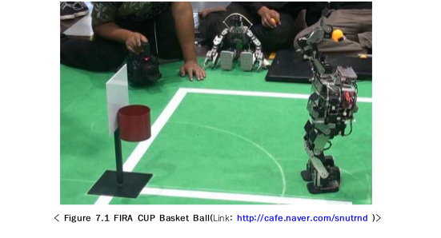

#### 7-2.Penalty-Kick

The penalty kick uses the algorithm for the recently updated IRC penalty Kick rules. Then the robot tilts its head up to detect the goal. The robot then labels the ends of the goal into the system. Then the robot turns in respect to the appropriate shooting range. The robot tilts its head down more a more precise turns. The robot does the kick when it finally
determines the ball is in its shooting range. The robots may switch the legs for a desired shot.

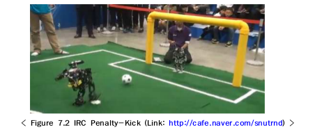

### 8.Conclusion

Team_RND’s robots have well built structures and a strong kicking motion in 10cm orange ball. The team also built a goalie robot with grips in preparation for the bigger goal. We self-manufactured the gyro sensors for a more convenient diagram of the robot. Our vision is completed with the data obtained by the data from the camera for self-localization. The images of the camera allow the robot to determine the distance from the ball, as well as its coordinates so that the robot is fully functional in calculating the pathway. Using this calculation and the data, the robot determines its own actions. One of
the many things that our team would like to point out is that most of motor controllers and sensors that are used in our robots are built from scratch in our lab. We have trust in our creations and their functionalities. We would love to show our designs and establishments in RoboCup.

# Video

# News

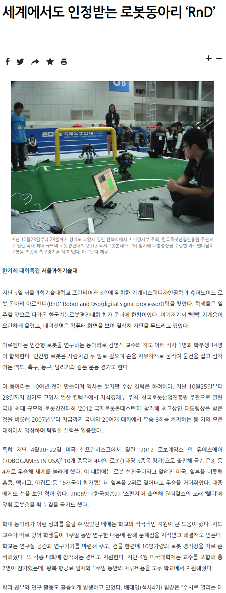

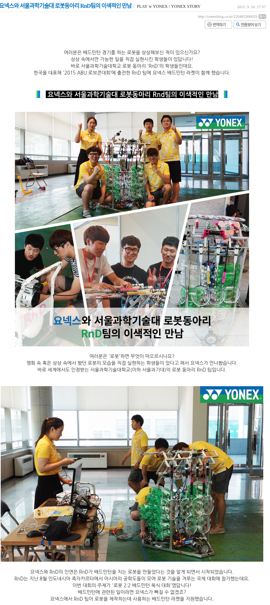

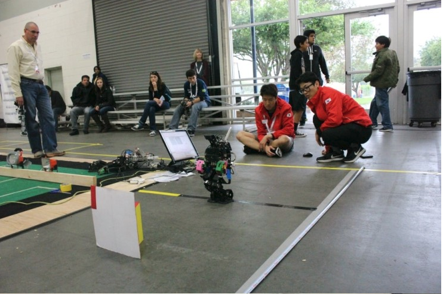

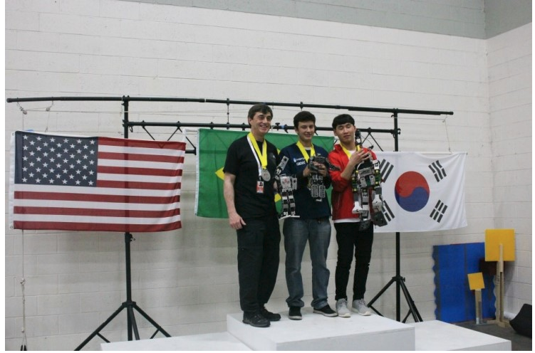

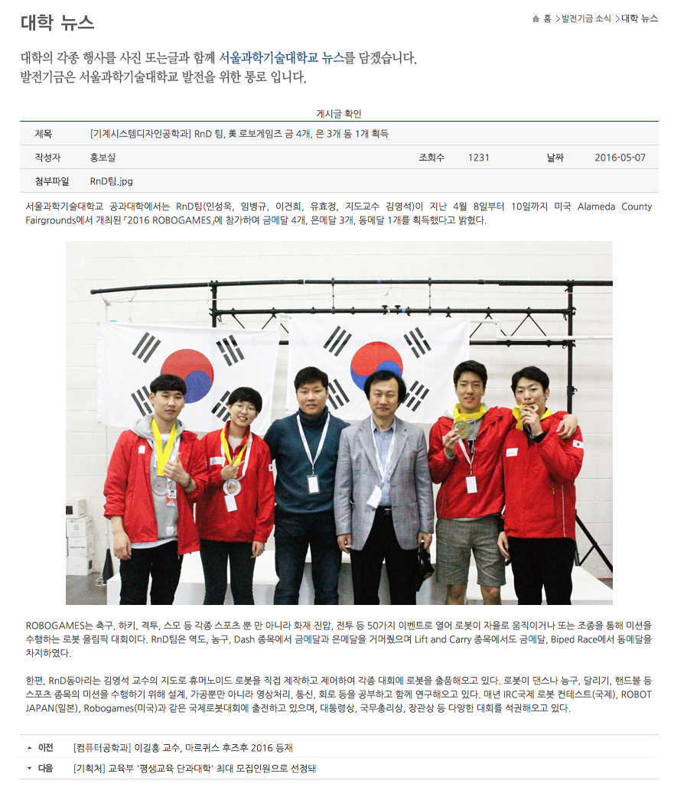

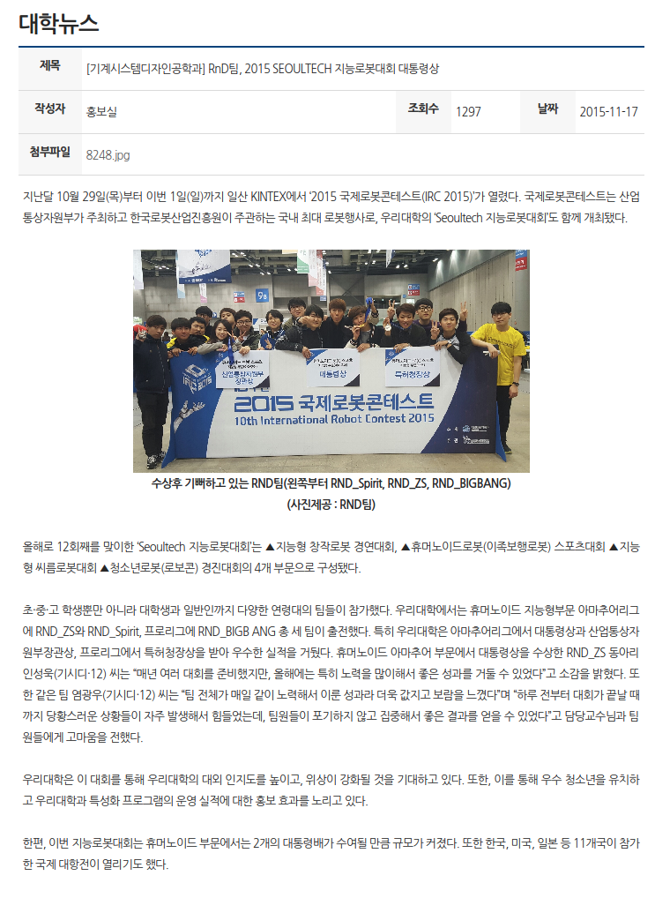

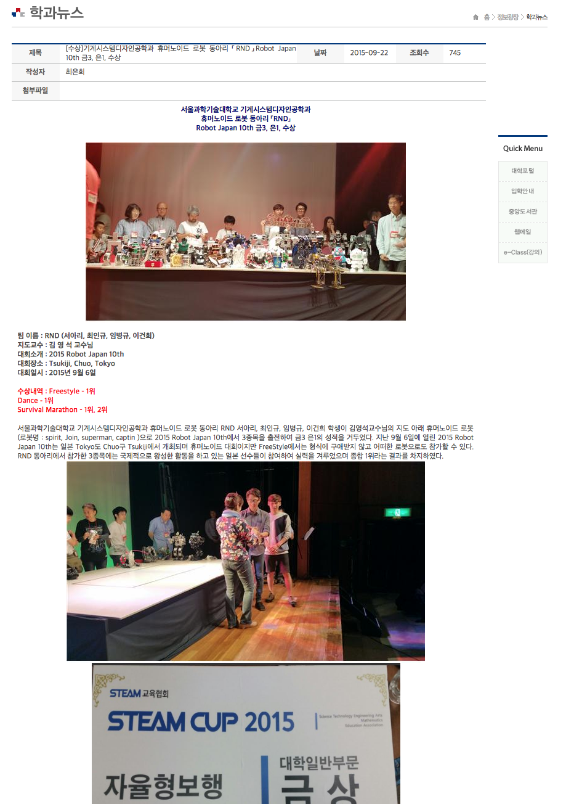

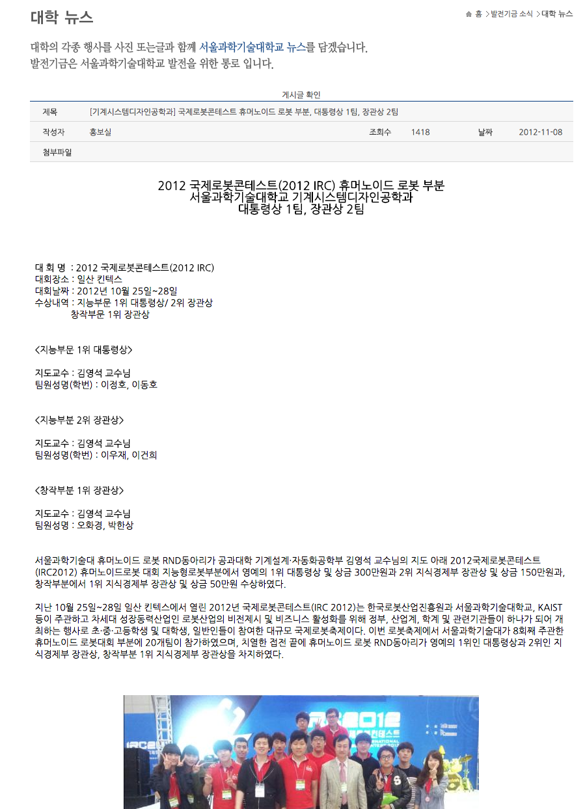

